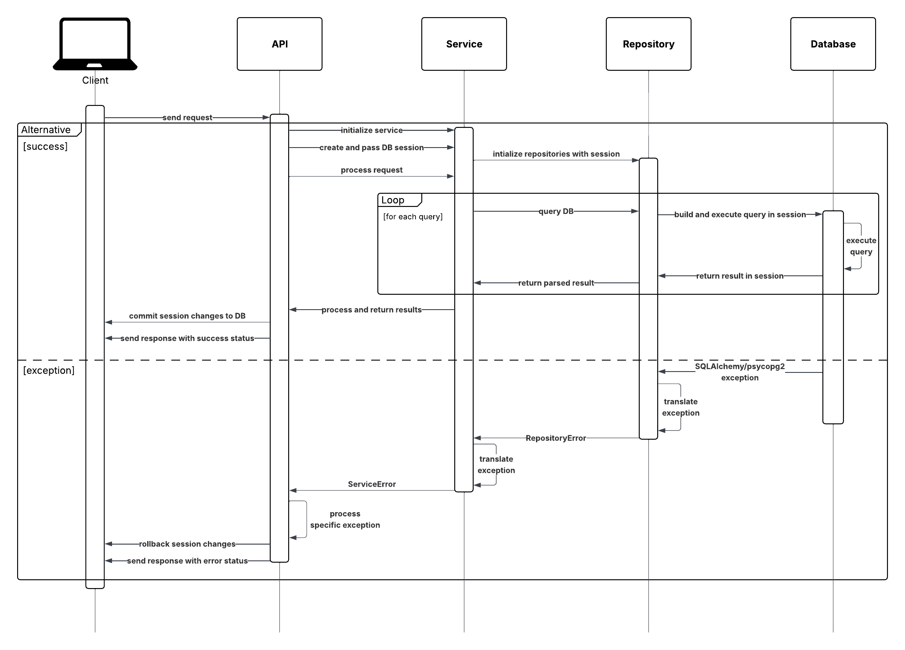

Our application leverages **Flask** and **SQLAlchemy**, which are the two key libraries to handle HTTP requests and define when database transactions begin and end. The API layer defines the various endpoints, contains the Flask route handlers responsible for parsing requests and responses, and creates request-specific database sessions to be used by the layers below.

A request starts when the API layer receives and validates client request parameters in an endpoint handler. If the parameters are valid, a [*scoped session*](https://flask-sqlalchemy.readthedocs.io/en/stable/api/#flask_sqlalchemy.SQLAlchemy.session) is instantiated, which can be accessed via `db.session` in the `backend.database` module after a Flask application context is created.

Promptly after a session is created, it is provided with additional necessary data to an appropriate *Service* layer module to process the request. If an error does not occur in any of the layers below, all changes in the session are then persisted in the database (via a `commit`) and the resulting data is sent back to the client in a response payload. Errors that propagate to the API layer are processed by a corresponding error handler in [`api_core.exceptions`](./core/exceptions.md), which revert any changes made in the database session, returning a proper error response to the client.

*Notes*:

- All API endpoints start with the `/api` prefix.
- All request and response bodies are in JSON format.

## Table of Contents

- API Core
    - [Decorators](./core/decorators.md)
    - [Exceptions](./core/exceptions.md)
- [User](user.md)
- [Volunteer](volunteer.md)
- [Station](station.md)
- [Train History](history.md)
- [Recent Activities](recent.md)
- [Record Collation](collation.md)
