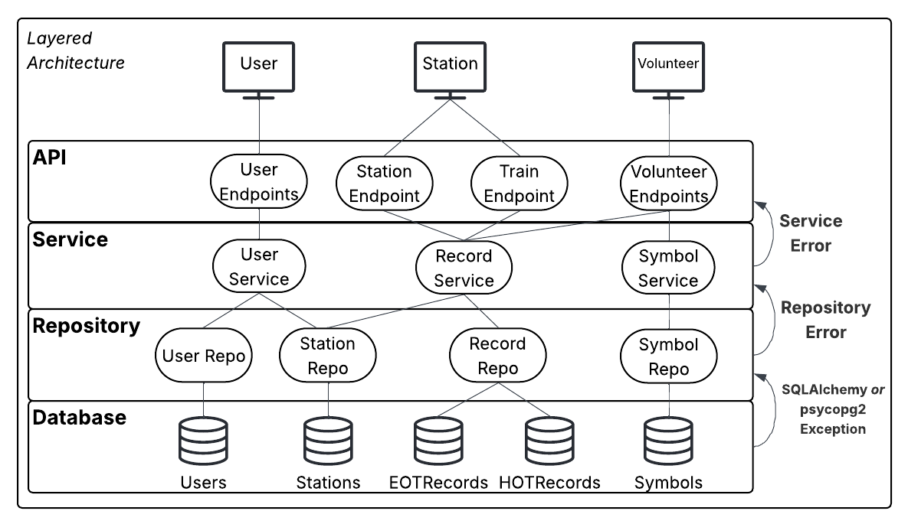

# Backend Documentation

The project we received at the beginning of the year was essentially a prototype and limited effort was dedicated to planning and building a robust backend architecture. Everything in the backend was directly derived from the content we learned in SWEN344, and all logic was embedded into the Flask endpoint handlers.

Therfore, our team decided to dedicate most of our time to refactoring the architecture of the backend in hopes of reducing the degree of technical debt in the future. We settled upon a layered architecture, which would delegate functional reponsibilities that span across the layers. Overall, we believe that this would ease the process modifying anything in the backend.

For example, changes to business rules are reflected in the Service layer only, leaving the Repository layer unaffected as it is only concerned with querying the database. Finally, the API layer’s responsibilities remain relatively minimal, only concerning itself with validating requests, returning HTTP responses, while delegating most of the heavy lifting to the layers below.

There are three layers that exist in the form of Python modules: `backend/src/[api,service,db]`. It is important to note that the Repository layer contains ORM models that correspond to the PostgreSQL tables; more is explained in the ***Repository*** section.




## API
### Summary

### Endpoints
#### `/symbols`
**Body:**
```json
{
    "blah": 1
}
```

## Service

## Repository

## Error Handling
