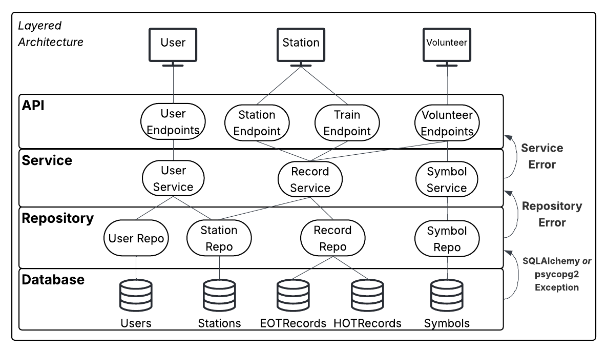

# Backend Documentation

The project we received at the beginning of the year was essentially a prototype and limited effort was dedicated to planning and building a robust backend architecture. Everything in the backend was directly derived from the content we learned in SWEN344, and all logic was embedded into the Flask endpoint handlers.

Therfore, our team decided to dedicate most of our time to refactoring the architecture of the backend in hopes of reducing the degree of technical debt in the future. We settled upon a layered architecture, which would delegate functional reponsibilities that span across the layers. Overall, we believe that this would ease the process modifying anything in the backend.

For example, changes to business rules are reflected in the Service layer only, leaving the Repository layer unaffected as it is only concerned with querying the database. Finally, the API layer’s responsibilities remain relatively minimal, only concerning itself with validating requests, returning HTTP responses, while delegating most of the heavy lifting to the layers below.

There are three layers that exist in the form of Python modules: `backend/src/[api,service,db]`. It is important to note that the Repository layer contains ORM models that correspond to the PostgreSQL tables; more is explained in the ***Repository*** section.



**The layered architecture above provides a high-level illustration of the different interactions and dependencies in the system.** *Note: Additional database tables exist but have been excluded for simplicity.*

## API

Our application leverages **Flask** and **SQLAlchemy**, which are the two key libraries to handle HTTP request and define when database transactions begin and end. The API layer defines the various endpoints, contains the Flask route handlers responsible for parsing requests and responses, and creates request-specific databases session to be used by the layers below.
*Note: All API endpoints start with the `/api` prefix.* 

A request starts when the API layer receives and validates client request parameters in an endpoint handler. If the parameters are valid, a *scoped session* is instantiated through a `sessionmaker`, which can be accessed by `db.session` in the `backend.database` module after a Flask application context is created.

Promptly after a session is created, it is provided with additional necessary data to an appropriate Service Layer module to process the request. If an error does not occur in any of the layers below, all changes in the session are then persisted in the database and the resulting data is sent back to the client in a response payload. Errors that propagate to the API layer are processed by a corresponding error handler in `api.api_core.exceptions`, which revert any changes made in the database session, returning a proper error response to the client.


**The sequence diagram above illustrates the processes involved in both successful and failed client requests.**

## Volunteer Endpoints

These endpoints can only be accessed by users with *Volunteer* or *Admin* permissions. The `role_required` decorator in `api.api_core.decorators` can be applied to a Flask route to restrict access exclusively to certain authorized users.

**Example Route:**
Allows only Volunteers and Admins to make requests to this endpoint.
```python
@example_blueprint.get("/api/example")
@role_required(0, 1)
def get_records():
    ...
```

**Example Resource:**
Allows only Volunteers and Admins to access request this resource.
```python
class Example(Resource):
    @role_required(0, 1)
    def get(self):
        ...
```

---

### `volunteer_handler.py`
#### `GET /symbols`


**Body:**
```json
{
    "blah": 1
}
```

## Service

## Repository

## Error Handling
