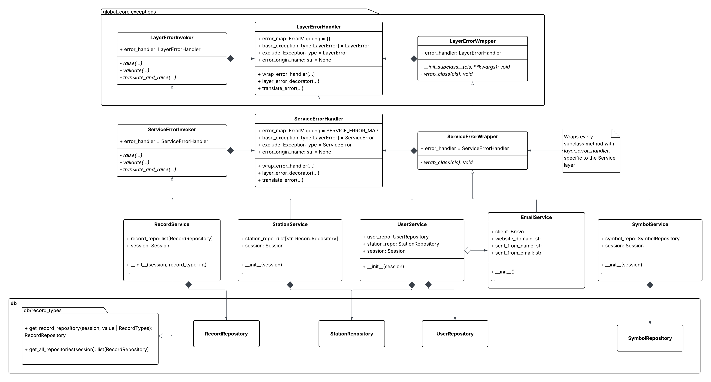

# Service Overview

This layer encapsulates business logic and orchestrates repository operations. Various services exist in the application, which all process client requests specific to their domain. For instance, the [`UserService`](#userservice) may need to access user and station data in the database in order to update the times at which a user prefers to receive station notifications. 
To interact with the database, this service instantiates both a *User* and *Station* repository to execute the necessary operations to accomplish this. If every action is successful, the service returns the parsed results back to the endpoint handler that called it in the [**API**](api.md) layer. 

A service may need to process different kinds of database records that require the same processing strategies, such as signal/train records. In the domain of this application, these records exist in one of several forms: EOT, HOT, and DPU, which contain shared and distinct attributes. To facilitate this, the [`RecordService`](#record-service) instantiates a [`RecordRepository`](repository.md#recordrepository) with the appropriate record and collation ORM models, specified by the client. Furthermore, some cases require this service to access all repositories in a single method. To accomplish this all repositories are created during instantiation and can be iterated over.

Currently, *five* services exist in the application, four of which extend [`BaseService`](#base-service) in [`service.service_core`](#service-core). The [`EmailService`](#emailservice) class does not require error handling functionality, as it is does not interact with any other layers.

**The class diagram above provides a somewhat simplified overview for the connected components in this layer.**

# Service Core

## Base Service
The purpose of `BaseService` is to provide a sublcass constructor for services that should be wrapped with the application's error handling logic using `wrap_error_handler` (see [Error Handling](errors.md)). Extending this class removes the need to manually integrate layer-specific exception handling for each method.

## Service Error Handling
This layer employs the standardized functionality from `global_core.exceptions` to translate [`RepositoryError`](repository.md#error-types) exceptions into [`ServiceError`](#error-types) exceptions. Additionally, this layer should specify the set of exceptions allowed to display their error messages to the **API** layer and client. To achieve this, the [`SERVICE_ERROR_MAP`](#repository-to-service-mapping) is used, where the key specifies the exception being translated, and the tuple contains the new exception along with a boolean indicating whether the error message should be shown in the response. If the *Flask* instance is in either testing or debugging mode, all error messages will be displayed, regardless of the current settings in the error map.

## Error Types

| Name | Description |
|------|-------------|
| `ServiceError` | Parent class for all errors in this layer. |
| `ServiceInternalError` | General errors that occur in the server. |
| `ServiceTimeoutError` | Connection interruptions, timeouts, etc. |
| `ServiceParsingError` | Value parsing or indexing issues. |
| `ServiceResourceNotFound` | Resource is not found such as a non-existing database row. |
| `ServiceExistingResourceError` | New resource requests to be created but conflicts with an existing one. |
| `ServiceEmailError` | Error occurs when sending an email in [`EmailService`](#emailservice). |
| `ServiceInvalidArgument` | Invalid argument is provided. |

## Repository to Service Mapping

| Original | Translation | Shown |
|----------|-------------|-------|
| [`RepositorySessionError`](repository.md#error-types) | `ServiceInternalError` | Yes |
| [`RepositoryExistingRowError`](repository.md#error-types) | `ServiceExistingResourceError` | Yes |
| [`RepositoryParsingError`](repository.md#error-types) | `ServiceParsingError` | No |
| [`RepositoryConnectionError`](repository.md#error-types) | `ServiceTimeoutError` | No |
| [`RepositoryNotFoundError`](repository.md#error-types) | `ServiceResourceNotFound` | Yes |
| [`RepositoryRecordInvalid`](repository.md#error-types) | `ServiceInvalidArgument` | Yes |
| [`RepositoryInvalidArgumentError`](repository.md#error-types) | `ServiceInvalidArgument` | Yes |
| [`RepositoryInternalError`](repository.md#error-types) | `ServiceInternalError` | No |

# RecordService

Handles business logic for signal/train record related data processing. Inherits [`BaseService`](#base-service).

## `__init__`

Upon initialization, a [`RecordRepository`](repository.md#recordrepository) is instantiated using the provided `record_type`. Uses [`get_record_repository`](repository.md#get_record_repository) or [`get_all_repositories`](repository.md#get_all_repositories) (if `record_type` is `None`), which are factory functions in [`db.record_types`](repository.md#record_types) designed for [`RecordRepository`](repository.md#recordrepository) initialization. Repositories are always stored in a list; use `get_first_repository` to access the repository passed in through the constructor. The service instance is initialized with a SQLAlchemy session to be shared across all repository instances.

If an invalid value is passed in for `record_type`, a [`ServiceInvalidArgument`](#error-types) is raised.

### Arguments

| Name | Type | Required | Description |
|------|------|----------|-------------|
| `session` | Session | Yes | The SQLAlchemy session to be used for database transactions in the service's repositories. |
| `record_type` | int *or* None | Yes | An integer corresponding to a record type, or None if repositories for all record types should be initialized. The integer values corresponding to each record type are defined in [`db.record_types`]().

## `get_train_record`
Queries the repository created in the constructor to return the signal/train record with the provided ID. The columns queried vary for each record type.

### Arguments
| Name | Type | Required | Description |
|------|------|----------|-------------|
| `record_id` | int | Yes | A value corresponding to a record's primary key. |

### Returns

*dict*: A dictionary containing the queried columns and values. See [`get_train_history`](repository.md#get_train_history) in the **Repository** layer documentation for more details.

## `create_train_record`

Creates a new record in the database. Afterwards, the following logic occurs:
- Attempt to automatically update a new record's symbol ID and engine number from the previous most recent record: [`attempt_auto_fill`](#attempt_auto_fill).
- Update the recency status of the previous record so that the newly created record is the most recent: [`add_new_pin`](#add_new_pin).
- Check to see if a notification needs to be sent: [`check_recent_notification`](#check_recent_notification).
- Send a notification to subscribed users using a notification service (future implementation).

The notification system was broken when we received the project; however, the request should also determine whether input data warrants sending a notification, and then make the appropriate calls to notify users about the new train data. A service for sending notifications could be implemented in a similar way like [`EmailService`](#emailservice).

Creates a record using the repository created during initialization.

### Arguments

| Name | Type | Required | Description |
|------|------|----------|-------------|
| `args` | dict | Yes | A dictionary containing the values of the new record, where the keys correspond to the database columns in a record's table. See the repository documentation for details about the required values: [`create_train_record`](repository.md#create_train_record). |

### Returns
*int*: ID of the newly created record.

## `check_recent_notification`
Checks if any train records with the specified unit address have been detected at a station within the last 10 minutes. If records exist, then this method indicates that a notification should be sent. Checks for records using the repository created during initialization. Called in [`create_train_record`](#create_train_record). 

### Arguments
| Name | Type | Required | Description |
|------|------|----------|-------------|
| `unit_addr` | str | Yes | The unit address corresponding to a record. |
| `station_id` | str | Yes | The station ID a signal was detected at. |

### Returns
*bool*: True if a notification should be sent out for a new record; otherwise, false.

## `add_new_pin`
Updates the most recent record with the provided unit address using the repository created during initialization. Called in [`create_train_record`](#create_train_record). 

### Arguments
| Name | Type | Required | Description |
|------|------|----------|-------------|
| `unit_addr` | str | Yes | The unit address shared by multiple records  to be updated. |

### Returns
*None*

## `attempt_auto_fill`
Updates a record with the symbol ID and engine number of the previous most recent record with the same unit address. Updates the record table using the repository created during initialization. Called in [`create_train_record`](#create_train_record). 

### Arguments
| Name | Type | Required | Description |
|------|------|----------|-------------|
| `unit_addr` | str | Yes | The unit address of a record to update. |

### Returns
*None*

## `signal_update`
Updates the symbol ID and engine number of a record using the repository created during initialization.

### Arguments
| Name | Type | Required | Description |
|------|------|----------|-------------|
| `record_id` | str | Yes | The ID of the record to update. |
| `symbol_id` | int | No | The ID of a symbol to add to a record. |
| `engine_num` | int | No | The engine number to add to a record. |

### Returns
*int **or** None*: Returns the ID if the record has been successfully updated; otherwise, this method returns `None`.

## `get_collated_records`

Retrieves a paginated collation of train records grouped by unit address and station. The number of records returned is defined by `NUM_RESULTS` (a constant declared in this module), and the total number of pages is calculated based on the total number of results. Can return records that are verified, unverified, or both depending on the value of the `verified` parameter. See [`get_record_collation`](repository.md#get_record_collation) for more details on the values returned by this method.

### Arguments
| Name | Type | Required | Description |
|------|------|----------|-------------|
| `page` | int | Yes | The page number of records to retrieve, 1-indexed. |
| `verified` | bool | No | The ID of a symbol to add to a record. |
| `engine_num` | int | No | If True or False, filters records by their `verified` status. If None, no filter is applied. Defaults to None. |

### Returns
*dict*: Returns a dictionary with two keys:
- `results`: A list of records, where each record is a dictionary with keys
corresponding to database columns. The columns returned vary for each
record type, for more information on the columns returned for each record type, check [`get_record_collation`](repository.md#get_record_collation) for more details.
- `totalPages`: The total number of pages available based on the number of
results and `NUM_RESULTS`.

## `verify_record`
Verifies a record by updating its symbol ID, locomotive number, and setting its `verified` flag to true. Updates a record using the repository created during initialization.

### Arguments
| Name | Type | Required | Description |
|------|------|----------|-------------|
| `record_id` | str | Yes | The ID of the record to update. |
| `symbol_id` | int | No | The ID of a symbol to add to a record. |
| `locomotive_num` | str *or* None | No | The locomotive number to add to a record. |

### Returns
*None*

## `time_frame_pull`
Pulls all records that have been recorded at a station within a provided timerange from the current time. The resulting records will be sorted in descending order by the date they were received. This method queries record repositories for each record type, and will query a [`StationRepository`](repository.md#stationrepository) if the station ID is not provided.

Only pulls from all repositories if this service has been instantiated with a `record_type` value of `None`; otherwise, only records with the type passed into the constructor will be retrieved.

### Arguments
| Name | Type | Required | Description |
|------|------|----------|-------------|
| `time_range` | str | Yes | A string in the format "HH:MM:SS" representing the time range to pull records from relative to the current time. |
| `recent` | bool | No | If True or False, only returns records based on their `most_recent` flag; otherwise, returns all records within the time frame. |
| `station_id` | int | No | The ID of the station to pull records from. If not provided, `station_name` must be provided. |
| `station_name` | str | No | The name of the station to pull records from. If not provided, `station_id` must be provided. |

### Returns
*list[dict[str, Any]]*: A list of dictionaries, each representing a record within the specified time frame. Each dictionary will contain a key named: `Data_type` which specifies the type of record.

# StationService
Handles business logic for station related data processing. Inherits [`BaseService`](#base-service).

## `__init__`
Initializes a [`StationRepository`](repository.md#stationrepository) with a provided **SQLAlchemy** session.

### Arguments
| Name | Type | Required | Description |
|------|------|----------|-------------|
| `session` | Session | Yes | The SQLAlchemy session to be used for database transactions in the service's repository. |

## `get_stations`
Returns a list of station ID and name pairs from the database as dictionaries.

### Returns
*list[dict]*: A list of dictionaries containing station IDs and names.

## `create_station`
Creates a new station in the database with the provided name. Additionally, a random password is generated using [`generate_password_string`](#generate_password_string), and associated with the new station.

### Arguments
| Name | Type | Required | Description |
|------|------|----------|-------------|
| `station_name` | str | Yes | The name of the new station. |

### Returns
*str*: The new randomly generated password for the new station.

## `update_station_password`
Generates and updates the password of a specified station. The password is generated using [`generate_password_string`](#generate_password_string).

### Arguments
| Name | Type | Required | Description |
|------|------|----------|-------------|
| `station_id` | int | Yes | The ID corresponding to the station to update. |

### Returns
*str*: The new randomly generated password for the station.

## `generate_password_string`
Generates a password string of 10 to 15 random uppercase ASCII and digit characters. Additionally, the password is hashed using SHA256.

### Returns
*tuple[str, str]*: Returns two strings in which the first is the unhashed password and the second is the hashed password.

## `get_last_seen`
Returns a formatted timestamp string of when a station last pinged the server.

### Arguments
| Name | Type | Required | Description |
|------|------|----------|-------------|
| `station_name` | str | Yes | The name of the station. |

### Returns
*str*: A formatted string containing the time and/or date of the ping. If the date is today, it is formatted as `HH:MM AM/PM`; otherwise, it is formatted as `MON DD, YYYY at HH:MM AM/PM`.

## `update_last_seen`
Updates a station's ping timestamp to the date and time at which this method is called.

### Arguments
| Name | Type | Required | Description |
|------|------|----------|-------------|
| `station_id` | int | Yes | The ID of the station to update. |

## `format_date`
Formats a datetime object into a string. If the date is today, it is formatted as `HH:MM AM/PM`; otherwise, it is formatted as `MON DD, YYYY at HH:MM AM/PM`.

### Arguments
| Name | Type | Required | Description |
|------|------|----------|-------------|
| `dt` | datetime | Yes | The datetime instance to format. |

### Returns
*str*: The formatted date string.

# SymbolService
Handles business logic for symbol related data processing. There isn't much currently, but might be very useful in the future for symbol operations.

## `__init__`
Initializes a [`SymbolRepository`](repository.md#symbolrepository) with a provided **SQLAlchemy** session.

### Arguments
| Name | Type | Required | Description |
|------|------|----------|-------------|
| `session` | Session | Yes | The SQLAlchemy session to be used for database transactions in the service's repository. |

## `get_symbol`
If a symbol name is provided, the ID corresponding to that symbol is returned; otherwise, a list of all symbols names in the database are returned.

| Name | Type | Required | Description |
|------|------|----------|-------------|
| `symbol_name` | str *or* None | Yes | The name of a symbol to retrieve. Can be `None` to retrieve all symbol names. |

### Returns
*list[str] **or** str*:  A list of symbol names or the ID of a specific symbol.

## `create_symbol`
Creates a new symbol in the database with the provided name. A symbol with the same name must not already exist in the database, otherwise an error is raised.

### Arguments
| Name | Type | Required | Description |
|------|------|----------|-------------|
| `symbol_name` | str | Yes | The name of the new symbol to be created. |

### Returns
*int*: The ID of the newly created symbol.

# UserService

# EmailService

