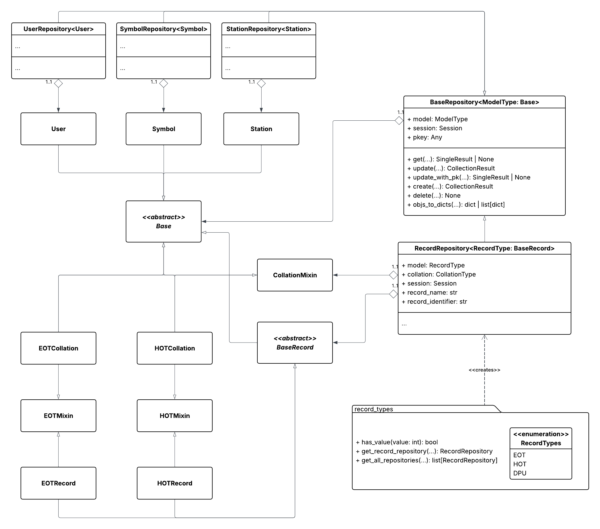

# Repository Overview
This layer aims to provide an interface for direct database access. This layer utilizes SQLAlchemy’s Object Relational Mapping (ORM) library to provide a robust system for mapping Python model objects to database tables (see [ORM Models](#orm-models)). We utilize SQLAlchemy’s query construction interface to perform operations on pre-defined models that track the changes made in a database session. Another benefit of ORMs is that they reduce the refactoring effort required when switching database technologies by abstracting query construction, generating and executing service-specific SQL from model definitions at runtime. 

As previously mentioned, changes can either be committed to the database if successful or rolled back in the case of an error, offering an effective way to properly manage client-server transactions. However, this layer should only responsible for flushing its changes to the session; the [**API**](api.md) layer should be the final decider on whether changes should be reverted or persisted to the database. When a repository method is successful and that method's query returns a model or `Row`, that data is converted to a dictionary representation for consistency, abstracting away model details from the layer above. 



**The class diagram above provides a somewhat simplified overview for the connected components in this layer. `RecordRepository` uses the `Station` and `Symbol` models for the [`get_train_history`](#get_train_history) and [`get_records_at_station`](#get_records_at_station) queries, which isn't shown in the diagram.**

# ORM Models
All of the models are defined in `db.db_core.models`. All models inherit [`Base`](#base), an abstract class that provides useful methods and contains SQLAlchemy metadata of the database. Some models contain `relationship` attributes that define how tables are related to one another. Most models are simply Python ORM mappings of the existing tables, so only the `Base` and `Record` models will be covered here.

## Base
Defines the abstract ORM base in which all models extend. All classes that extend this class will contain useful functions such as `_asdict` and `copy`.

### `__init__`
An ORM instance can be constructed by passing in a set of keyword arguments.

#### Arguments
| Name | Type | Required | Description |
|------|------|----------|-------------|
| `kwargs` | dict | Yes | A collection of keyword arguments used to create an ORM instance. The keys map to the columns defined in the model. All columns that are not nullable must be present as values in the arguments. Additionally, the values must match the type defined in the model.

### Other Methods
- `_asdict`: Returns a ORM instance as a dictionary representation.
- `__hash__`: Calculates the hash of an ORM instance.
- `__eq__`: Compares whether an ORM instance is equal to another instance.
- `copy`: Creates a copy of an ORM instance as a new instance.

## Records

### BaseRecord
An abstract model that defines the mapped attributes and relationships shared by `EOTRecord`, `HOTRecord`, and the future `DPURecord`. This model is used to represent the rows in each of the record tables.

### CollationMixin
Provides the mapped columns shared by `EOTCollation`, `HOTCollation`, and the future `DPUCollation`. This mixin provides mappings for the results from the collation views.

### EOTMixin & HOTMixin
Provides the mapped columns for type-specifc columns. Used in both the respective EOT & HOT record and collation models.

# Error Handling

This layer defines three function definitions that override the standard error handling functionality defined in `global_core.exceptions`, which work specifically for the **Repository** layer. Each function is defined within `db_core.exceptions`, and all utilize the same error map: [`REPOSITORY_ERROR_MAP`](#repository-error-mapping), which is also defined in the same file.

## `wrap_repository_error_handler`
Used to wrap a function with repository-specific erorr handling logic.

### Example
```python
def some_method(number):
    ...

wrapped()  # Will not translate exceptions
wrapped = wrap_repository_error_handler(some_method)
wrapped(5)  # Translates exceptions
```

## `repository_error_handler`
Translates a provided exception into a [`RepositoryError`](#error-types). Optional arguments can be provided for additional functionality or details. Useful for when variables need to be logged in the exception.

### Arguments
| Name | Type | Required | Description |
|------|------|----------|-------------|
| `e` | `Exception` | Yes | An exception that is to be translated. |
| `caller_name` | `str` | No | The class that called this function. |
| `point_of_error` | `str` | No | The location/function the error occurred in. |
| `message` | `str` | No | An custom message to provide in a the exception. |
| `exclude` | `tuple[Type[Exception]]` *or* `Type[Exception]` | No | A single or collection of exception types to exclude from translation. Any exceptions defined here will pass through untouched. Defaults to `RepositoryError`. |

### Example
```python
def some_method(self, arg: int):
    try:
        if arg < 1:
            # Repository-specific exceptions will pass through
            raise RepositoryInvalidArgumentError(
                caller_name=self.__class__.__name__,
                poe="some_method",
                message="Argument cannot be less than 1, provided with {arg}!"
                show_error=True
            )
    except Exception as err:
        # All other exceptions will be translated, and 'arg' will be shown in message
        raise translate_error(
            err,
            caller_name=self.__class__.__name__,
            point_of_error="some_method",
            message=f"Could not finish some_method with argument: {arg}"
        )
```

## `repository_error_handler`
Decorator used to provide error translation for exceptions thrown in this layer.

### Arguments
| Name | Type | Required | Description |
|------|------|----------|-------------|
| `message` | `str` | No | An custom message to provide in a the exception. |
| `exclude` | `tuple[Type[Exception]]` *or* `Type[Exception]` | No | A single or collection of exception types to exclude from translation. Any exceptions defined here will pass through untouched. Defaults to `RepositoryError`. |

### Example
```python
# All exceptions thrown in this method will be translated and re-raised
@repository_error_translator()
    def some_repository_method(self):
        ...
```


## Error Types
Below are the following exceptions that can be raised by any of the methods in this layer.

| Name | Description |
|------|-------------|
| `RepositoryError` | Parent class for all errors in this layer. |
| `RepositorySessionError` | An error occurs with a session in the repository, or is not provided during the instantiation of a repository. |
| `RepositoryConnectionError` | Connection interruptions, timeouts, etc. |
| `RepositoryParsingError` | Value parsing, indexing issues, or problem constructing a valid query. |
| `RepositoryNotFoundError` | Resource is not found such as a non-existing database row. |
| `RepositoryExistingRowError` | New resource requests to be created but conflicts with an existing one. |
| `RepositoryInvalidArgumentError` | Invalid argument is provided. |
| `RepositoryRecordInvalid` | Invalid record type is provided to [`get_record_repository`](#get_record_repository). |
| `RepositoryInternalError` | An unknown exception raised in the layer. |

## Repository Error Mapping
All *SQLAlchemy*, *psycopg2*, and *Python* exceptions are caught by the error handling logic in `db_core.exceptions`. All error messages are set to be shown, it is the responsibility of the layers above to hide the messages or not. Below are the current mappings present in the application, which can be extended or changed in the future.

| Original | Translation |
|----------|-------------|
| `TimeoutError`, `UnboundExecutionError`, `InterfaceError`, `NoSuchModuleError` | `RepositoryConnectionError` |
| `TypeError`, `KeyError`, `ValueError`, `IndexError`, `ZeroDivisionError`, `DataError`, `ProgrammingError`, `IntegrityError` | `RepositoryParsingError` |
| `NoResultFound` | `RepositoryNotFoundError` |
| `MultipleResultsFound` | `RepositoryExistingRowError` |
| `SQLAlchemyError` | `RepositoryInternalError` |

# BaseRepository
Base class for a repository, supporting CRUD functionality for SQLAlchemy ORMs. This class uses a generic, `ModelType`, which is bounded to the [`Base`](#base) model, defining the model to operate on. Methods in this class return `ModelType`, but conversion to a `dict` as a return type is supported.

Found within `db_core.repository`.

## `__init__`
Constructor for a repository. Defines the model and SQLAlchemy `Session` that the repository operates on. If the model and session are valid, this instance maintains a reference to the model's primary key through `pkey`.

### Arguments
| Name | Type | Required | Description |
|------|------|----------|-------------|
| `model` | ModelType | Yes | The SQLAlchemy ORM model which extends `Base` that the repository will operate on. The model provided defines which table to manipulate in a provided `Session`. |
| `session` | Session | Yes | The SQLAlchemy session to use for database operations. |

## `get`
Retrieves an ORM instance from the session's current state. By default, this method returns a dictionary representation of the result, which can be turned off by setting `to_dict` to `False`. A `RepositoryNotFoundError` will is thrown if the primary key cannot be found in the current session.

### Arguments
| Name | Type | Required | Description |
|------|------|----------|-------------|
| `pkey` | Any | Yes | Primary key value to search for in the current session, typically an `int` or `str`. |
| `to_dict` | bool | No | Specifies whether retrieved instance should be returned as the `ModelType` or `dict`. Setting this field to `True` returns the results as a `dict`; otherwise, a `ModelType`. Default value is True. |

### Raises
[*RepositoryNotFoundError*](#error-types): Thrown if the instance cannot be found in the current session with the provided `pkey`.

### Returns
*SingleResult*: A `ModelType` or `dict` instance of the result.

## `update`
Updates the provided objects with the provided new values. The `objs` parameter is a list of tuples, where each tuple contains an `ModelType` instance to update and a dictionary of new values to update that instance with. By default, this method returns a list of dictionary representations of the updated results, which can be turned off by setting `to_dict` to `False` to instead return a list of `ModelType` instances.

### Arguments
| Name | Type | Required | Description |
|------|------|----------|-------------|
| `objs` | list[tuple[ModelType, dict[str, Any]]] | Yes | A list of tuples, where each tuple contains a `ModelType` instance (index 0) to update and a dictionary of new values to update that instance with (index 1). The keys in the dictionary should correspond to column names in the table, and the values should be the new values to update those columns with. To prevent updates to the primary key, any keys in the update dictionaries that match the primary key column (`self.pkey`) are ignored. An error will be thrown if any of the update dictionaries contain keys or values that are incompatible with the model's attributes or corresponding column types. |
| `to_dict` | bool | No | Specifies whether the updated instance should be returned as a `ModelType` or `dict`. Setting this field to `True` returns the results as a `dict`; otherwise, a `ModelType`. Default value is True. |

### Raises
[*RepositoryInvalidArgumentError*](#error-types): Thrown if any of the provided objects are not instances of `ModelType` or if any of the provided update keys are not attributes of the table.

[*RepositoryParsingError*](#error-types): Thrown if any of the provided update values are incompatible with the corresponding column types in the model.

Other [*RepositoryError*](#error-types) exceptions may be thrown depending on errors raised when performing database operations, such as connection errors or internal errors.

### Returns
CollectionResult: A list of `ModelType` or `dict` instance containing the updated results, depending on the value of `to_dict`. If the provided `objs` is empty, an empty list is returned. Additionally, if no updates are made to the provided objects, an empty list is returned.

## `update_with_pk`
Updates a single ORM instance in the current session. If an instance can be found in the session from a provided primary key (`pkey`), its values will be updated to those present in `new_values`. Similar to other functions, the updated instance can be returned as a `ModelType` or dictionary representation depending on the value of `to_dict`. If no updates are made, this function will return `None`.

### Arguments
| Name | Type | Required | Description |
|------|------|----------|-------------|
| `pkey` | int *or* str | Yes | The primary key value corresponding to the instance to update. This value is used to retrieve the instance from the current session, and an error is thrown if an instance with a matching primary key cannot be found. |
| `new_values` | dict[str, Any] | Yes | A dictionary mapping column names to new values to update the instance with. The keys in this dictionary should correspond to column names in the table, and the values should be the new values to update those columns with.
| `to_dict` | bool | Yes | Specifies whether the updated instance should be returned as a `ModelType` or `dict`. Setting this field to `True` returns the results as a `dict`; otherwise, a `ModelType`. Default value is True. |

### Raises
[*RepositoryInvalidArgumentError*](#error-types): Thrown if any of the provided update keys are not attributes of the table.

[*RepositoryParsingError*](#error-types): Thrown if any of the provided update values are incompatible with the corresponding column types in the model.

[*RepositoryNotFoundError*](#error-types): Thrown if an instance cannot be found in the current session with the provided `pkey`.

### Returns
*SingleResult **or** None*: A `ModelType` or `dict` instance containing the updated results, depending on the value of `to_dict`. If no updates are made, `None` is returned.


## `create`
Creates one or more new records in the database from the provided data. Instantiates model instance from the given data, adds them to the session, and flushes them to the database. The flush persists the records and generates necessary values (e.g. primary keys). This method does not commit these changes, thus, they are not reflected in the database until a higher layer commits them.

### Arguments
| Name | Type | Required | Description |
|------|------|----------|-------------|
| `new_values` | dict[str, Any] | Yes | A dictionary mapping column names to new values to update the instance with. The keys in this dictionary should correspond to column names in the table, and the values should be the new values to update those columns with. |
| `to_dict` | bool | Yes | Specifies whether the newly created instance should be returned as a `ModelType` or `dict`. Setting this field to `True` returns the results as a `dict`; otherwise, a `ModelType`. Default value is True. |

### Raises
[*RepositoryParsingError*](#error-types): This exception is thrown if any of of these conditions occur: 
- If the provided data cannot be mapped to the model, such as invalid types (ProgrammingError). 
- Malformed `new_data` (eg. not a valid `dict`) (TypeError). 
- If a database error occurs during the flush, such as a primary key collision (IntegrityError).


## `delete`
Deletes an instance from the database that matches the provided value, which can be a primary key or an instance of `ModelType`. If a primary key is provided, the instance with the matching primary key will be retrieved and deleted. If an instance of `ModelType` is provided, that instance will be deleted. In either case, the session is flushed to reflect the changes in the current session, but these changes are not committed until a higher layer commits them.

### Arguments
| Name | Type | Required | Description |
|------|------|----------|-------------|
| `value` | int *or* str *or* ModelType | Yes | A primary key value or an instance of `ModelType` to delete from the database. |

### Raises
[*RepositoryNotFoundError*](#error-types): If the instance to delete cannot be found in the current session.

## objs_to_dicts
Converts one or more instances to their dictionary representations. The provided values should be instances of a type that supports dictionary conversion.

### Arguments
| `value` | AsDictConvertible *or* Sequence[AsDictConvertible] | Yes | A single instance or sequence of instances that support dictionary conversion, such as [`Base`](#base) or SQLAlchemy `Row` objects. |
| `convert_to_string` | set[str] | No | A set of keys specifying which
columns in the resulting dictionaries should have their values converted to strings. Default value is an empty set, meaning no fields will be converted to strings. |

### Raises
[*RepositoryParsingError*](#error-types): Raised if a provided object is not compatible with dictionary conversion.

### Returns
*dict[str, Any] **or** list[dict[str, Any]]*: A dictionary representation of the provided values. If any keys are specified in `convert_to_string`, then the corresponding values for those keys will be converted to strings in the returned dictionaries.


# `record_types`
A module responsible for defining the record types with an ORM model compatible with [`RecordRepository`](#recordrepository). Furthermore, this module also provides two factory functions to instantiate record repositories.

## RecordTypes
An enum that contains the types of train records in the application.
| Type | Value |
|------|-------|
| **EOT** | 1 |
| **HOT** | 2 |
| **DPU** | 3 |

## get_record_repository
This function acts as a factory for instantiating a [`RecordRepository`](#recordrepository). Given a `value` that corresponds to a valid train record type, a new repository instance will be returned, including the appropriate ORM model and collation types.

### Arguments
| Name | Type | Required | Description |
|------|------|----------|-------------|
| `session` | Session | Yes | An SQLAlchemy database session created by a Flask endpoint in which the new repository instance operates with. |
| `value` | int *or* [RecordTypes](#record_types) | Yes | An identifier that specifies the table/record type a [`RecordRepository`](#recordrepository) interacts with. |

### Raises
*RepositoryRecordInvalid*: Raised if `value` is an invalid instance or does not correspond to an appropriate train record type.

### Returns
*RecordRepository*: A repository instance that queries type-specific train records. None if a record type should exist, but is not implemented yet.

## get_all_repositories
Returns a list of [`RecordRepository`](#recordrepository) instances for every train/signal record type.

### Arguments
| Name | Type | Required | Description |
|------|------|----------|-------------|
| `session` | Session | Yes | An SQLAlchemy database session created by a Flask endpoint in which the new repository instances operate with. |

### Returns
*list[RecordRepository]*: A list of `RecordRepository` instances. Each repository corresponds to a train/signal record type. If a record type does not have an implemented repository, it is not included in the returned list.

# RecordRepository
A database interface for train/signal record querying. This class inherits the generic CRUD functionality defined in [`BaseRepository`](#baserepository) that may be useful for simple operations. This class also contains concrete methods which execute standardized functionality using the model defined in an instance, restricted only to models that extend [`BaseRecord`](#baserecord). The results are defined by the [`BaseRecord`](#baserecord) and [`CollationMixin`](#collationmixin) models.

This class functions a little bit differently than what was shown in our final presentation. Once we switched to ORMs, the strategy pattern we used was redundant.

## `__init__`
Constructor for a repository that interacts with various kinds of train records. See [`record_types`](#record_types) for factory method implementations.

### Arguments
| Name | Type | Required | Description |
|------|------|----------|-------------|
| `model` | Type of [`BaseRecord`](#baserecord) | Yes | An ORM class that defines what database table to perform queries on and map results to. Only models that extend `BaseRecord` are permitted. |
| `collation` | Type of [`CollationMixin`](#collationmixin) | Yes | An ORM model that defines the attributes of the results returned by [`get_record_collation`](#collationmixin). Only models that extend `CollationMixin` are permitted. |
| `session` | Session | Yes | Specifies the database session the repository operates in. All functions in this class flushes all changes to the session. It is the job of higher layers to commit or rollback any changes. |
| `record_name` | str | No | Attributes a name to the records in the repository. Primarily for error logging purposes. Defaults to "Unknown". |
| `record_identifier` | str | No | Attributes a unique identifer for records in the repository. Particularly useful when parsing data. Defaults to "Unknown". |

## `get_total_record_count`
Retrieves total number of records present in the table during a given session.

### Returns
*int*: Number of records present in the provided table defined by `model`.


## `get_train_history`
Returns a train record with the following columns: `id, date_rec, station_name, symb_name, unit_addr, verified` and the columns defined in a concrete model's `get_unique_fields` method (shown below).

### Arguments
| Name | Type | Required | Description |
|------|------|----------|-------------|
| `record_id` | int | Yes | A value corresponding to a record's primary key. |

### Returns
*dict*: A dictionary with keys associated to predefined columns and their values.

***All Records Return the Following Columns:***
| Name | Type |
|------|------|
| `id` | int |
| `date_rec` | str |
| `station_name` | str |
| `symb_name` | str |
| `unit_addr` | str |
| `verified` | bool |

***EOT Records Return the Following Additional Columns:***
| Name | Type |
|------|------|
| `brake_pressure` | str |
| `motion` | str |
| `marker_light` | str |
| `turbine` | str |
| `batter_cond` | str |
| `battery_charge` | str |
| `arm_status` | str |
| `signal_strength` | str |

***HOT Records Return the Following Additional Columns:***
| Name | Type |
|------|------|
| `frame_sync` | str |
| `command` | str |
| `checkbits` | str |
| `parity` | str |


## `create_train_record`
Creates a new train record with the provided values in `args`. When an error occurs during the initial creation of a record, a recovery request can be sent. When a recovery request is sent, the datetime must be passed as a parameter; otherwise, a `RepositoryInvalidArgumentError` is raised. In order to successfully create a new train record, the keys and values in the dictionary must include **all non-nullable columns** and **correct value types** with that of the model to prevent an `IntegrityError` occurring. Keys not present as columns in the model are ignored.

### Arguments:
| Name | Type | Required | Description |
|------|------|----------|-------------|
| `args` | dict[str, int] | Yes | A dictionary containing values to insert into a new record. |
| `datetime_received` | datetime | No | The datetime when the record was received. This argument must be provided if `date_rec` is not a key in `args`.

**EOT & HOT Fields in `args`**
| Name | Type | Nullable | Default |
|------|------|----------|---------|
| `date_rec` | str | No | *N/A* |
| `station_recorded` | int | No | *N/A* |
| `symbol_id` | int | Yes | `None` |
| `engine_num` | int | Yes | `None` |
| `unit_addr` | str | Yes | `"unknown"` |
| `verified` | bool | Yes | `False` |
| `verifier_id` | int | Yes | `None` |
| `most_recent` | bool | Yes | `True` |
| `locomotive_num` | str | Yes | `"unknown"` |
| `signal_strength` | float | Yes | `0.0` |

**EOT Fields in `args`**
| Name | Type | Nullable | Default |
|------|------|----------|---------|
| `brake_pressure` | str | Yes | `"unknown"` |
| `motion` | str | Yes | `"unknown"` |
| `marker_light` | str | Yes | `"unknown"` |
| `turbine` | str | Yes | `"unknown"` |
| `battery_cond` | str | Yes | `"unknown"` |
| `battery_charge` | str | Yes | `"unknown"` |
| `arm_status` | str | Yes | `"unknown"` |

**HOT Fields in `args`**
| Name | Type | Nullable | Default |
|------|------|----------|---------|
| `frame_sync` | str | Yes | `"unknown"` |
| `command` | str | Yes | `"unknown"` |
| `checkbits` | str | Yes | `"unknown"` |
| `parity` | str | Yes | `"unknown"` |

### Raises
[*RepositoryInvalidArgumentError*](#error-types): If no timestamp is provided for both `datetime_received` and `date_rec` (in `args`).

[*RepositoryParsingError*](#error-types): If a non-nullable column or an incorrect value type is provided in `args` 

### Returns:
*tuple[int, bool]*: Returns the ID of the newly created record and whether a recovery request was used to create the record.

## `get_unit_record_ids`
Retrieves record IDs associated with a given unit address. Queries the database session and the model defined in the constructor for all record IDs matching the specified unit address, ordered ascending by ID. Optionally returns only the most recent (highest) ID.

### Arguments
| Name | Type | Required | Description |
|------|------|----------|-------------|
| `unit_addr` | str | Yes | The unit address used to filter records. |
| `recent` | bool | No | If True, returns only the most recent record ID. Defaults to False. | 

### Raises
[*RepositoryNotFoundError*](#error-types): If no records are found for the given `unit_addr`.

### Returns
*int **or** list[int]* A single integer ID if `recent=True`, or a list of all matching integer IDs if `recent=False`.

## `get_recent_trains`
Queries the database session and model defined in the constructor for all records matching the specified unit address and station ID where the recorded date is within the last 10 minutes.

### Arguments
| Name | Type | Required | Description |
|------|------|----------|-------------|
| `unit_addr` | str | Yes | The unit address used to filter records. |
| `station_id` | int | Yes | The station ID used to filter records. |
| `id_only` | bool | No | If True, returns only the IDs of the matching records. Defaults to False. |

### Returns
*list[dict]*: A list of matching train records as dictionaries. Returns an empty list if no records are found.


## `add_new_pin`
Sets the most recent column for a group of records with matching unit addresses. Sets `most_recent` to false for all most recent records with matching unit addresses with distinct IDs.

### Arguments
| Name | Type | Required | Description |
|------|------|----------|-------------|
| `record_id` | int | Yes | The record ID that is excluded from update. |
| `unit_addr` | str | Yes | The unit address used to filter records. |

### Returns
*list[int]*: Returns a list of IDs of the records that were updated.


## `get_record_column_by_unit_addr`
Gets the values for each record with matching unit addresses for a given field.

### Arguments
| Name | Type | Required | Description |
|------|------|----------|-------------|
| `unit_addr` | str | Yes | The unit address used to filter records. |
| `field_type` | str | Yes | The column name to retrieve values from. |
| `most_recent` | bool *or* None | No | Filters records by their recency. If None, all records will be scanned. Defaults to None. |

### Raises
[*RepositoryInvalidArgumentError*](#error-types): Raised if the model does not contain the provided field.

### Returns
*list[Any]*: Returns a list of values from records.


## `update_signal_values`
Updates a record's `symbol_id` and `engine_num` with a matching ID. This method ignores new values with invalid types such that they will not be reflected in the database session.

### Arguments
| Name | Type | Required | Description |
|------|------|----------|-------------|
| `record_id` | int | Yes | The ID of the record to update. |
| `symbol_id` | int | No | The new symbol ID value. |
| `engine_num` | int | No | The new engine number value. |

### Returns
*dict[str, Any] **or** None*: Returns a dictionary containing the newly updated values. Returns None if no updates were made in the session.


## `get_record_collation`
Retrieves a paginated collation of train records grouped by unit address and station.

Executes a multi-stage SQL query that groups train records by unit address and station, where a new group is formed when either the station changes or a duration of more than 2 hours elapses between records. Returns the most recent record per group along with aggregate information such as `first_seen`, `last_seen`, `occurrence_count`, and `duration`. The total count of grouped records for pagination is appended to each collation result and can be accessed via `total_count` (see the [collation ORMs](#collationmixin) in [`db_core.models`](#orm-models) for more details). Optionally filters results by verification status if provided.

This function uses collation views to query results which should already be added to the Tracksense PostgreSQL database server. However, it can be found in `backend/test/table.sql` if it is removed for any reason.

### Arguments
| Name | Type | Required | Description |
|------|------|----------|-------------|
| `page` | int | Yes | The page number (offset) to retrieve, 1-indexed. |
| `num_results` | int | Yes | The number of results to return per page. |
| `verified` | bool | No | If True or False, filters records by their `verified` status. If None, no filter is applied. Defaults to None. |

### Raises
[*RepositoryError*](#error-types): If any stage of the query, count, or result parsing fails.

### Returns
A tuple containing: 
- *list[dict]*: The paginated and collated train records as dictionaries (index 0).
- *int*: The total number of pages based on `num_results` (index 1).


## `verify_record`
Verifies a record by updating its symbol ID, locomotive number, and verified status. Sets `verified` to True on the specified record along with the provided `symbol_id` and `locomotive_num` values. Uses [`update_with_pk`](#update_with_pk) in [`BaseRepository`](#baserepository) to flush changes to the session.

### Arguments
| Name | Type | Required | Description |
|------|------|----------|-------------|
| `record_id` | int | Yes | The ID of the record to update. |
| `symbol_id` | int | No | The updated symbol ID of the record. |
| `locomotive_num` | str *or* None | No | The updated locomotive number of the record. |

### Raises
[*RepositoryError*](#error-types): If an exception occurs for any reason.

### Returns
*dict[str, Any] **or** None*: The updated record as a dictionary representation. None if no updates were made in the session.

## `get_records_at_station`
Retrieves records with the station they were recorded at. 

Records can be filtered based on the station they were recorded by passing a matching `station_id`. If `station_id` is `-1`, the station filter is not applied and will return records across all stations. When `dt` is provided, the database is queried to filter all records with a `date_rec` at or after `dt`. If a value is passed for `recent`, the records will be filtered with their matching recency status.

If `all_cols` is `False`, only the following columns are retrieved: `id, unit_addr, date_rec, station_name, symb_name, engine_num, locomotive_num`; otherwise, every column in a record is retrieved, including the corresponding `symb_name` and `station_name`.

Joins with `Station` and `Symbol` to include the station and symbol name references in the returned records. A record's `Data_type` field, which is derived from a repository's `record_identifier`, is appended to each result.

### Arguments
| Name | Type | Required | Description |
|------|------|----------|-------------|
| `station_id` | int | No | The station ID to filter records by. Pass `-1` to retrieve records across all stations. Defaults to `-1`. |
| `dt` | datetime | No | A lower bound datetime instance to filter records by `date_rec`. Defaults to None. |
| `recent` | bool | No | If True or False, filters records by their `most_recent` value. If None, no filter is applied. Defaults to None. |
| `all_cols` | bool | No | If True, all columns of a record are returned;  otherwise, only a portion are returned. Defaults to False. |

### Raises
[*RepositoryError*](#error-types): If an exception is raised for any reason.

### Returns
*list[dict[str, Any]]*: A list of matching records as dictionaries, each containing `id`, `unit_addr`, `date_rec`, `station_name`, `symb_name`, `engine_num`, `locomotive_num`, `Data_type`, and additional columns if specified. Returns an empty list if no records are found.


# StationRepository
A database interface for querying station records.

This class inherits the generic CRUD functionality defined in `BaseRepository` that may be useful for simple operations. This class contains concrete methods which execute functionality using the `Station` model.


## `__init__`
Constructor for a repository that interacts with station records. References a database session that is used by all queries.

### Arguments
| Name | Type | Required | Description |
|------|------|----------|-------------|
| `session` | Session | Yes | Specifies the database session the repository operates in. All functions in this class flushes all changes to the session. It is the job of higher layers to commit or rollback any changes. |


## `get_stations`
Returns a collection of ID and station name pairs from the database.

### Returns
(list[dict[str, Any]]): A list of dictionaries containing `id` and `station_name` for each station.


## `create_new_station`
Creates a new station from `stat_name` and a `hashed_password` in the database.

### Arguments
| Name | Type | Required | Description |
|------|------|----------|-------------|
| `station_name` | str | Yes | The name of a new station. Must not already exist in the database. |
| `hashed_password` | str | Yes | A hashed password for the new station. |

### Raises
[*RepositoryExistingRowError*](#error-types): Raised if a station with the same name already exists.

### Returns
*int*: The ID of the newly created station.

## `update_station_password`
Updates a station's password with `hashed_password` if a matching `station_id` exists.

### Arguments
| Name | Type | Required | Description |
|------|------|----------|-------------|
| `station_name` | str | Yes | The ID of the station to update. |
| `hashed_password` | str | Yes | The new hashed password for the station. |

### Raises
[*RepositoryNotFoundError*](#error-types): Raised if a station with `station_id` does not exist.

[*RepositoryInvalidArgumentError*](#error-types): Raised if either argument is of the incorrect type.


## `get_station_id`
Returns the ID of a station with a matching station name.

### Arguments:
| Name | Type | Required | Description |
|------|------|----------|-------------|
| `station_name` | str | Yes | The name of the station. |

### Raises
[*RepositoryNotFoundError*](#error-types): Raised if a station with `stat_name` does not exist.

### Return
*str*: The ID of the station.


## `get_last_seen`
Returns a datetime instance of the station's last seen timestamp.

### Arguments
| Name | Type | Required | Description |
|------|------|----------|-------------|
| `stat_name` | str | Yes | The name of the station. |

Raises:
[*RepositoryNotFoundError*](#error-types): Raised if a station is not found.

### Returns
*datetime*: A datetime instance of a station's last seen timestamp.


## `update_last_seen`
Updates a station's last seen timestamp to the current time during execution.

### Arguments:
| Name | Type | Required | Description |
|------|------|----------|-------------|
| `station_id` | str | Yes | The ID of the station to update. |

### Raises
[*RepositoryNotFoundError*](#error-types): Raised if a station is not found.

### Return
*datetime*: A datetime instance representing the updated timestamp.


# SymbolRepository
A database interface for querying symbol records.

This class inherits the generic CRUD functionality defined in `BaseRepository` that may be useful for simple operations. This class contains concrete methods which execute functionality using the `Symbol` model.


## `__init__`
Constructor for a repository that interacts with symbol records. References a database session that is used by all queries.

### Arguments
| Name | Type | Required | Description |
|------|------|----------|-------------|
| `session` | Session | Yes | Specifies the database session the repository operates in. All functions in this class flushes all changes to the session. It is the job of higher layers to commit or rollback any changes. |


## `get_symbol_name`
Returns the name of a symbol when provided with its corresponding ID.

### Arguments
| Name | Type | Required | Description |
|------|------|----------|-------------|
| `id` | int | Yes | ID of a symbol. |

Returns:
*str*: A corresponding symbol name.
    
Raises:
[*RepositoryNotFoundError*](#error-types): Raised if a symbol row is not found with the provided ID.

## `get_symbol_names`
Retrieves all symbol names stored in the database.

### Returns
*list*: All list of symbol names as strings if the database retrieval was successful.


## `get_symbol_id`
Retrieves a symbol ID given the name of a symbol from the database.

### Arguments:
| Name | Type | Required | Description |
|------|------|----------|-------------|
| `symbol_name` | str | Yes | The name of the symbol in the database. |

### Returns
*int*: The ID of the symbol as an int if the database retrieval was successful.
        
### Raises
[*RepositoryNotFoundError*](#error-types): Raised if a symbol row is not found with the provided name.


## `insert_new_symbol`
Creates a new symbol in the database.

### Arguments:
| Name | Type | Required | Description |
|------|------|----------|-------------|
| `symbol_name` | str | Yes | The name of the symbol to create in the database. |

### Returns
*int*: The ID of the newly created symbol.

### Raises
[*RepositoryExistingRowError*](#error-types): Raised if a symbol with the same name already exists.


# UserRepository


