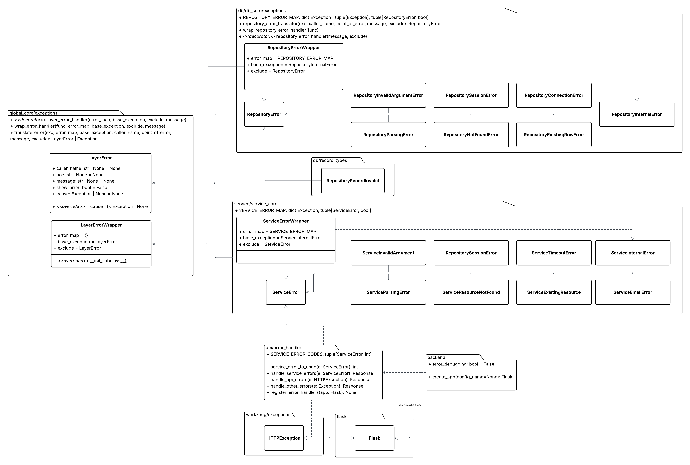
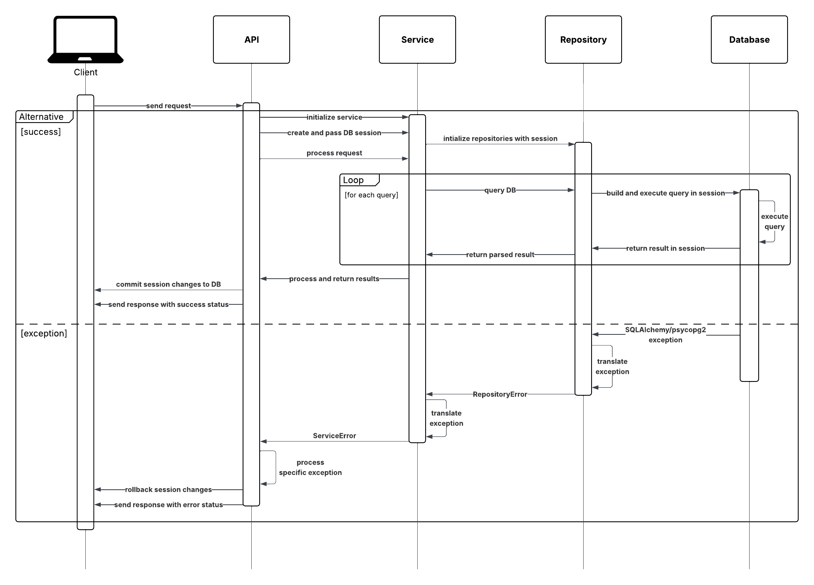

# Error Handling Overview

One of our goals for the refactoring process was to construct a standardized error handling system that would propagate exceptions through the chain of layers. Such a system will allow future developers to easily attach error handling to new features, expose only necessary details of lower-level exceptions in production environments, permit full error traceability in development environments, and group similar errors into generalized layer exceptions. 

To achieve this, we incorporate Python’s function decorators to wrap class methods across the layers with an error translation mechanism. Any exceptions raised in a decorated function would immediately be mapped to a layer-specific error through translation. When an exception moves from the [**Service**](service.md) layer to the [**API**](service.md), the response receives a status code and an error message that is either generalized or specific, depending on the exception provided and the Flask environment that was created.

The code for the error handling is located in the `db_core.exceptions` module, and can be used in any of the layers. The [**API**](api.md) layer uses the error handlers provided by *Flask*, but the [**Service**](service.md) and [**Repository**](repository.md) layers utilize the error handling logic described here.

**Error Handling Class/Module Diagram**


**Request Sequence Diagram**


# LayerError
This is the parent class for all the exceptions in the different layers. Both [`ServiceError`](service.md#error_types) and [`RepositoryError`](repository.md#error-types) inherit this class. A `default_message` is included in every `LayerError` to be used when details should be abstracted from the client, and a child exception should specify a unique message in their class definition.

## `__init__`
The contents of a message include the following:
- An optional caller prefix in the format `[caller_name]`
- A public-facing message
    - Either the class's `default_message` or, if debugging is enabled, the location and details of the error.


The example below showcases an example of an error message returned by a [GET /history](api.md#get-history) request when debugging mode is enabled:
```
"[RecordService] Exception raised in get_train_record! RepositoryNotFoundError: [RecordRepository] Exception raised in get_train_history! Could not get record with ID = 9999999! | NoResultFound: No row was found when one was required"
```
In this message, the trace shows that the functions that were called that produced these errors: 
**get_train_record** &rarr; **get_train_history** &rarr; **NoResultFound**.
Additionally, the instances that were called are also shown: **RecordService** &rarr; **RecordRepository**.

When debugging mode is disabled, such as in a production environment, the exception would look like this:
```
"[RecordService] Could not get record with ID = 9999999!"
```
In this message, a developer would still be able to determine the service the exception occurred and view additional details.

### Arguments
| Name | Type | Required | Description |
|------|------|----------|-------------|
| `caller_name` | `str` | No | Name of the caller (typically a class) used as a prefix for the error message, e.g., the name of the service or repository raising the exception. Defaults to None. |
| `point_of_error` | `str` | No | Point of error that identifies where in the code the exception was raised, e.g., a function or method name. Only included in the message when debugging is enabled. Defaults to None. |
| `message` | `str` | No | A detailed error message with specifics about the failure. Only added to the public message when debugging is enabled (via `error_debugging` in app creation) or `show_error`. Defaults to None. |
| `exclude` | [`ExceptionType`](#type-definitions-used) | No | If True, forces the detailed error message and point of error to be shown regardless of the global `error_debugging` flag. Defaults to False. |
| `cause` | `Exception` | No | The exception that is the cause of the error being instantiated. If provided, this exception is attached to the `LayerError` instance. Defaults to None. |


# Type Definitions Used
This class includes two `TypeAlias` definitions to shorten the type-hinting in the function signatures: 
- `ExceptionType`: Accepts either a single or tuple of `Exception` class(es).
- `ErrorMapping`: A dictionary in which a key, represented by an `ExceptionType`, is mapped to an `Exception` class along with a boolean value indicating whether an error message should be displayed.

# `wrap_error_handler`
Wraps a function with a general-purpose error-handling strategy. Catches exceptions and translates them into layer-specific errors via a provided error map. Any exception not covered by `error_map` or the `exclude` is caught and re-raised as the provided `base_exception` or itself, respectively. Preserves the original exception as the cause via `raise ... from e`. If `func` is an `__init__`, the function name displayed is renamed to *"intialization"*. This function is useful for when functions need to be wrapped during runtime.

## Arguments
| Name | Type | Required | Description |
|------|------|----------|-------------|
| `func` | `callable` | Yes | The function that is being wrapped with the error handling logic. |
| `error_map` | [`ErrorMapping`](#type-definitions-used) | No | A dictionary mapping of exception translations. Both single exception types and tuples of exception types are valid as keys, allowing multiple exceptions to map to the same target. Broader exceptions should be placed lower in the map because translation works by selecting the first match. |
| `base_exception` | Type of [`LayerError`](#layererror) | Yes | The fallback exception type raised when a caught exception has no matching entry in `error_map`. Ensures unhandled exceptions are still wrapped in a layer-appropriate error to prevent leaking lower-level implementation details. |
| `exclude` | [`ExceptionType`](#type-definitions-used) | No | An exception type or tuple of exception types that should be ignored in translation entirely. Useful for allowing certain exceptions to propagate without interference. Defaults to None. |
| `message` | `str` | No | A custom message to attach to the translated exception. If None, the default message in [`LayerError`](#layererror) is used. Defaults to None. |

## Returns
*callable*: `func` wrapped with the error handling logic.

## Example
```python
class CustomError1(LayerError):
    default_message = "Default message 1."

class CustomError2(LayerError):
    default_message = "Default message 2."

"""
IndexErrors will be mapped to CustomError1 with error message shown.

KeyErrors and ValueErrors will be mapped to CustomError2 with error message hidden.
"""
custom_map = {
    IndexError: (CustomError1, True),
    (KeyError, ValueError): (CustomError2, False)
}

def some_func(arg):
    ...

# Does not translate exceptions
some_func(1)

"""Now, exceptions raised in this function will now be mapped according to custom_map.

Any exception not included as a key in the map will be translated to LayerErrors.

Any LayerError raised in some_func will pass through untouched.
"""
wrapped = wrap_error_handler(
    func=some_func,
    error_map=custom_map,
    base_exception=LayerError,
    exclude=LayerError,
    message="Error raised in some_func, this isn't good..."
)
wrapped(1)
```


# `layer_error_handler`
Decorator to provide error translation for exceptions in backend layers. This decorator is applied to instance methods to automatically catch exceptions, translate them into layer-specific errors using an `error_map`, and re-raise them while preserving the original exception as the cause. Use this decorator when function variables aren't required to be shown in the error message. Uses the error handling logic in [`wrap_error_handler`](#wrap_error_handler).

## Arguments
| Name | Type | Required | Description |
|------|------|----------|-------------|
| `error_map` | [`ErrorMapping`](#type-definitions-used) | No | A dictionary mapping of exception translations. Both single exception types and tuples of exception types are valid as keys, allowing multiple exceptions to map to the same target. Broader exceptions should be placed lower in the map because translation works by selecting the first match. |
| `base_exception` | Type of [`LayerError`](#layererror) | Yes | The fallback exception type raised when a caught exception has no matching entry in `error_map`. Ensures unhandled exceptions are still wrapped in a layer-appropriate error to prevent leaking lower-level implementation details. |
| `exclude` | [`ExceptionType`](#type-definitions-used) | No | An exception type or tuple of exception types that should be ignored in translation entirely. Useful for allowing certain exceptions to propagate without interference. Defaults to None. |
| `message` | `str` | No | A custom message to attach to the translated exception. If None, the default message in [`LayerError`](#layererror) is used. Defaults to None. |

## Returns
*callable*: The original function wrapped with exception handling logic, with its signature and metadata preserved.

## Raises
The returned function will raise one of two exception types:
- `LayerError`: A translated exception determined by `error_map`, using `base_exception` as the fallback.
- `Exception`: If the exception matches a type in `exclude`, it is re-raised immediately.

## Examples

**Default Parameters:**
```python
class CustomError1(LayerError):
    default_message = "Default message 1."

class CustomError2(LayerError):
    default_message = "Default message 2."

custom_map = {
    IndexError: (CustomError1, True),
    (KeyError, ValueError): (CustomError2, False)
}

@layer_error_handler(error_map=custom_map, base_exception=LayerError)
def some_func(arg):
    ...
```

**Custom Parameters:**
```python
@layer_error_handler(
    error_map=custom_map
    base_exception=LayerError,
    exclude=LayerError,
    message="An error occurred!"
)
def some_repository_method(self):
    ...
```

# `translate_error`
Translates a provided `Exception` instance using a map of potential exception classes. Uses general-purpose logic to produce layer-specific errors. Any exception not covered by `error_map` is translated to a fallback exception provided in `base_exception`. All exceptions with a matching type in `exclude` are returned as-is. This function is useful for cases where function variables need to be included in error messages or when multiple points of failure may occur in a long function, each requiring different messages.

## Arguments
| Name | Type | Required | Description |
|------|------|----------|-------------|
| `exc` | `Exception` | Yes | The exception instance that will be translated. If its type does not correspond with a matching translation in `error_map`, or it has a matching type in `exclude`, the exception is returned as-is. |
| `error_map` | [`ErrorMapping`](#type-definitions-used) | No | A dictionary mapping of exception translations. Both single exception types and tuples of exception types are valid as keys, allowing multiple exceptions to map to the same target. Broader exceptions should be placed lower in the map because translation works by selecting the first match. |
| `base_exception` | Type of [`LayerError`](#layererror) | Yes | The fallback exception type raised when a caught exception has no matching entry in `error_map`. Ensures unhandled exceptions are still wrapped in a layer-appropriate error to prevent leaking lower-level implementation details. |
| `caller_name` | `str` | No | Name of the caller (typically a class) used as a prefix for the error message, e.g., the name of the service or repository raising the exception. Defaults to None. |
| `point_of_error` | `str` | No | Point of error that identifies where in the code the exception was raised, e.g., a function or method name. Only included in the message when debugging is enabled. Defaults to None. |
| `message` | `str` | No | A custom message to attach to the translated exception. If None, the default message in [`LayerError`](#layererror) is used. Defaults to None. |
| `exclude` | [`ExceptionType`](#type-definitions-used) | No | An exception type or tuple of exception types that should be ignored in translation entirely. Useful for allowing certain exceptions to propagate without interference. Defaults to None. |

## Returns
*[LayerError](#layererror) **or** Exception*: If a matching translation is found in `error_map`, a `LayerError` instance is returned. In the case a match is not found, the class provided in `base_exception` is instantiated and returned as a fallback, preventing lower-level implementation details from propagating upwards. If the provided exception `e` is an instance with a matching type in `exclude`, it is returned as-is.

## Example
```python
import sys

class CustomError1(LayerError):
    default_message = "Default message 1."

class CustomError2(LayerError):
    default_message = "Default message 2."

custom_map = {
    IndexError: (CustomError1, True),
    (KeyError, ValueError): (CustomError2, False)
}

class CustomClass:
    def some_function(self, arg):
        try:
            ...
        except Exception as e:
            raise translate_error(
                exc=e,
                error_map=custom_map,
                caller_name=self.__class__.__name__,
                point_of_error=sys._getframe().f_code.co_name,
                message=f"Error occurred doing something with {arg}!",
                exclude=LayerError
            )
```

# LayerErrorWrapper

A superclass that wraps all subclass methods with the error handling logic in [`wrap_error_handler`](#wrap_error_handler) and [`translate_error`](#translate_error). Methods are wrapped at subclass definition time, not when a subclass is instantiated.

## Default Attributes
This class specifies three class attributes that define how certain exceptions are translated. By default, all exceptions but [`LayerError`](#layererror) instances are translated into a [`LayerError`](#layererror). This behavior can be changed by adjusting the attributes below:

| Name | Type | Default | Description |
|------|------|---------|-------------|
| `error_map` | dict | `{}` | A dictionary mapping of exception translations. Both single exception types and tuples of exception types are valid as keys, allowing multiple exceptions to map to the same target. Broader exceptions should be placed lower in the map because translation works by selecting the first match. |
| `base_exception` | Type of [`LayerError`](#layererror) | [`LayerError`](#layererror) | The fallback exception type raised when a caught exception has no matching entry in `error_map`. Ensures unhandled exceptions are still wrapped in a layer-appropriate error to prevent leaking lower-level implementation details. |
| `exclude` | [`ExceptionType`](#type-definitions-used) | [`LayerError`](#layererror) | An exception type or tuple of exception types that should be ignored in translation entirely. Useful for allowing certain exceptions to propagate without interference. |

## Example

The example below defines a small set of exceptions for a layer. `ExampleClass` inherits from `LayerErrorWrapper` and specifies the translation mappings for any exceptions that occur within the underlying layer (in this case, `LowerClass`) as well as other built-in Python exceptions. Any unhandled exceptions are translated to an `ExampleInternalError`, and all errors raised within this layer propagate through, as they are subclasses of `ExampleLayerError`.

```python
from ..layer_below import LowerClass

class ExampleLayerError(LayerError):
    pass

class ExampleInternalError(ExampleLayerError):
    default_message = "An internal error occurred!"

class ExampleArgumentError(ExampleLayerError):
    default_message = "Bad argument provided!"

class ExamplePermissionError(ExampleLayerError):
    default_message = "Invalid permission provided!"

class ExampleClass(LayerErrorWrapper):
    # Assume exceptions from lower layer and Python are mapped
    error_map = {...}  
    base_exception = ExampleInternalError
    exclude = ExampleLayerError

    def __init__():
        self.lower_class = LowerClass()

    # This method is wrapped
    def higher_method_one(
        permission: int, 
        number_one: int, 
        number_two: int
    ):
        # Both of the exceptions below are ignored by LayerErrorWrapper
        if self.permission < 3:
            raise HigherPermissionError(
                self.__class__.__name__,
                sys._getframe().f_code.co_name,
                f"Invalid permission level: {permission}",
                True
            )

        if number_two == 0:
            raise HigherArgumentError(
                self.__class__.__name__,
                sys._getframe().f_code.co_name,
                f"The second number provided is 0!",
                True
            )

        # Exceptions that occur here are caught by LayerErrorWrapper
        result = self.lower_class.lower_method(permission, number_one)
        return result / number_two
    
    # This method is also wrapped
    def higher_method_two(...):
        ...
```